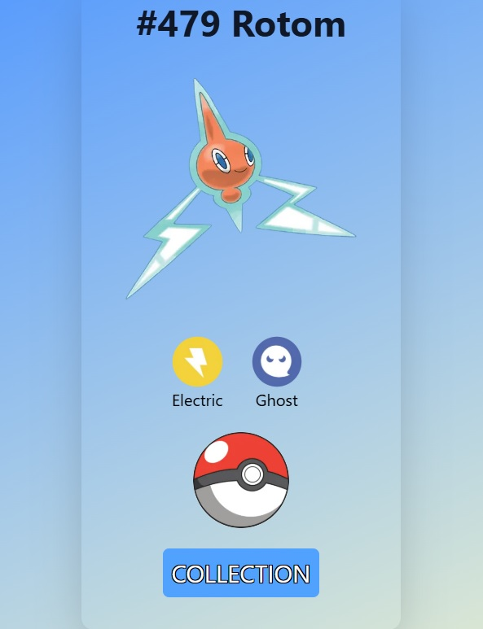
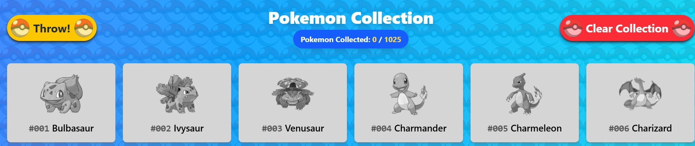

# 🎯 Pokémon Catcher App

A fun and interactive web app where you can **throw Pokéballs to catch random Pokémon**, view their types, and build your very own collection — all powered by [PokéAPI v2](https://pokeapi.co/). This is a personal project built to demonstrate frontend development skills using **Next.js** and **Tailwind CSS**.

## 🚀 Features

- 🎲 **Catch Random Pokémon**: Click the Pokéball to fetch a random Pokémon from the PokéAPI.
- 📸 **Pokémon Preview**: View the Pokémon's sprite and its type(s) when caught.
- 📦 **Local Collection**: Your captured Pokémon are saved in `localStorage` so your collection persists between visits.
- 📋 **Collection Tracker**: 
  - Colored Pokémon = caught.
  - Greyed-out Pokémon = not yet caught.
  - Count of total Pokémon caught displayed.
  
## 🛠 Tech Stack

- **Next.js** – React framework for fast and SEO-friendly rendering.
- **Tailwind CSS** – Utility-first CSS framework for responsive styling.
- **PokéAPI v2** – Public RESTful API for accessing Pokémon data.
- **LocalStorage** – Browser-based storage for maintaining collection data.

## 📸 Screenshots

### 🎯 Catching a Pokémon


### 📦 Viewing Your Collection


## 🚀 Deployment

This app is deployed with Vercel for seamless Next.js hosting.

**Live Demo:** [Pokemon Catcher App](https://poke-next-azure.vercel.app/)

## 📦 Installation & Development

```bash
# Clone the repo
git clone https://github.com/theguykai/poke-next.git
cd poke-next

# Install dependencies
npm install

# Run the development server
npm run dev

# Visit http://localhost:3000 in your browser
```

## 🎯 Purpose

This project was built for my **web development portfolio** to showcase my skills in React/Next.js, modern styling with Tailwind CSS, and basic API integration.

## 📄 License

This project is open-source and available under the MIT License.